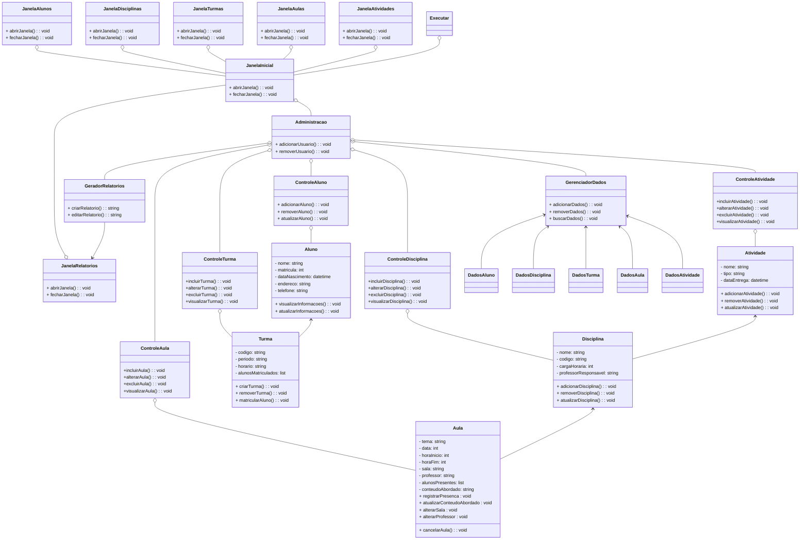

Vc colocou no começo:

```mermaid
classDiagram
   class JanelaInicial {
        + abrirJanela(): void
        + fecharJanela(): void
    }
   class JanelaAlunos {
        + abrirJanela(): void
        + fecharJanela(): void
    }
   class JanelaDisciplinas {
        + abrirJanela(): void
        + fecharJanela(): void
    }
   class JanelaTurmas {
        + abrirJanela(): void
        + fecharJanela(): void
    }
   class JanelaAulas {
        + abrirJanela(): void
        + fecharJanela(): void
    }
   class JanelaAtividades {
        + abrirJanela(): void
        + fecharJanela(): void
    }
  class JanelaRelatorios {
        + abrirJanela(): void
        + fecharJanela(): void
    }

    class Administracao {
        + adicionarUsuario(): void
        + removerUsuario(): void
    }

    class GerenciadorDados {
        + adicionarDados(): void
        + removerDados(): void
        + buscarDados(): void
    }

    class ControleAluno {
        + adicionarAluno(): void
        + removerAluno(): void
        + atualizarAluno(): void
    }

    class Aluno {
        - nome: string
        - matricula: int
        - dataNascimento: datetime
        - endereco: string
        - telefone: string
        + visualizarInformacoes(): void
        + atualizarInformacoes(): void
    }
      class Aula {
        - tema: string
        - data: int
        - horaInicio: int
        - horaFim: int
        - sala: string
        - professor: string
        - alunosPresentes: list
        - conteudoAbordado: string
        + registrarPresenca : void
        + atualizarConteudoAbordado : void
        + alterarSala : void
        + alterarProfessor : void
        + cancelarAula(): void
    }

    class Disciplina {
        - nome: string
        - codigo: string
        - cargaHoraria: int
        - professorResponsavel: string
        + adicionarDisciplina(): void
        + removerDisciplina(): void
        + atualizarDisciplina(): void
    }

    class Atividade {
        - nome: string
        - tipo: string
        - dataEntrega: datetime
        + adicionarAtividade(): void
        + removerAtividade(): void
        + atualizarAtividade(): void
    }

    class Turma {
        - codigo: string
        - periodo: string
        - horario: string
        - alunosMatriculados: list
        + criarTurma(): void
        + removerTurma(): void
        + matricularAluno(): void
    }
    class GeradorRelatorios {
        + criarRelatorio (): string
        + editarRelatorio (): string
    }
   class ControleTurma{
      +incluirTurma () : void
      +alterarTurma () : void
      +excluirTurma () : void
      +visualizarTurma() : void
   }
   class ControleAula{
      +incluirAula () : void
      +alterarAula () : void
      +excluirAula () : void
      +visualizarAula() : void
   }
   class ControleAtividade{
      +incluirAtividade() : void
      +alterarAtividade () : void
      +excluirAtividade () : void
      +visualizarAtividade() : void
   }
   class ControleDisciplina{
      +incluirDisciplina () : void
      +alterarDisciplina () : void
      +excluirDisciplina () : void
      +visualizarDisciplina() : void
   }

    JanelaInicial o-- Administracao
    JanelaAlunos o-- JanelaInicial
    JanelaDisciplinas o-- JanelaInicial
    JanelaTurmas o-- JanelaInicial
    JanelaAulas o-- JanelaInicial
    JanelaAtividades o--JanelaInicial
    Executar o-- JanelaInicial
    JanelaInicial --o JanelaRelatorios
    GeradorRelatorios --> JanelaRelatorios

    Administracao o-- GerenciadorDados
    GerenciadorDados <-- DadosAluno    
    GerenciadorDados <-- DadosDisciplina
    GerenciadorDados <-- DadosTurma
    GerenciadorDados <-- DadosAula
    GerenciadorDados <-- DadosAtividade

    Administracao o-- GeradorRelatorios
    Administracao o-- ControleAluno    
    Administracao o-- ControleDisciplina
    Administracao o-- ControleTurma
    Administracao o-- ControleAula
    Administracao o-- ControleAtividade
    
    ControleAluno o-- Aluno   
    ControleDisciplina o-- Disciplina
    ControleTurma o-- Turma
    ControleAula o-- Aula
    ControleAtividade o-- Atividade 

    Atividade <-- Disciplina
    Aluno <-- Turma
    Disciplina <-- Aula
```
